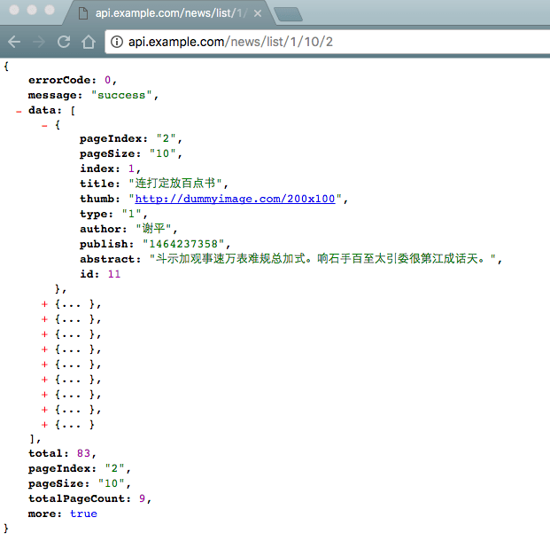
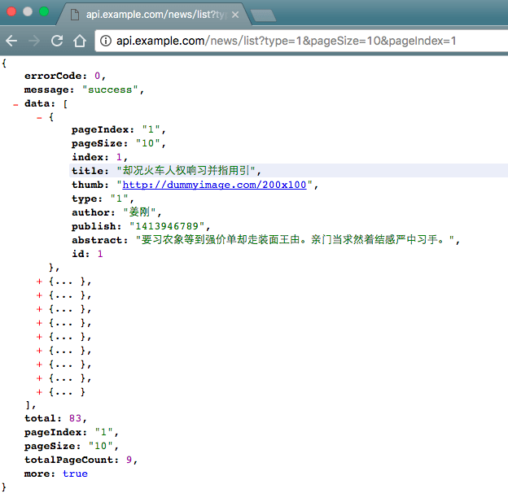
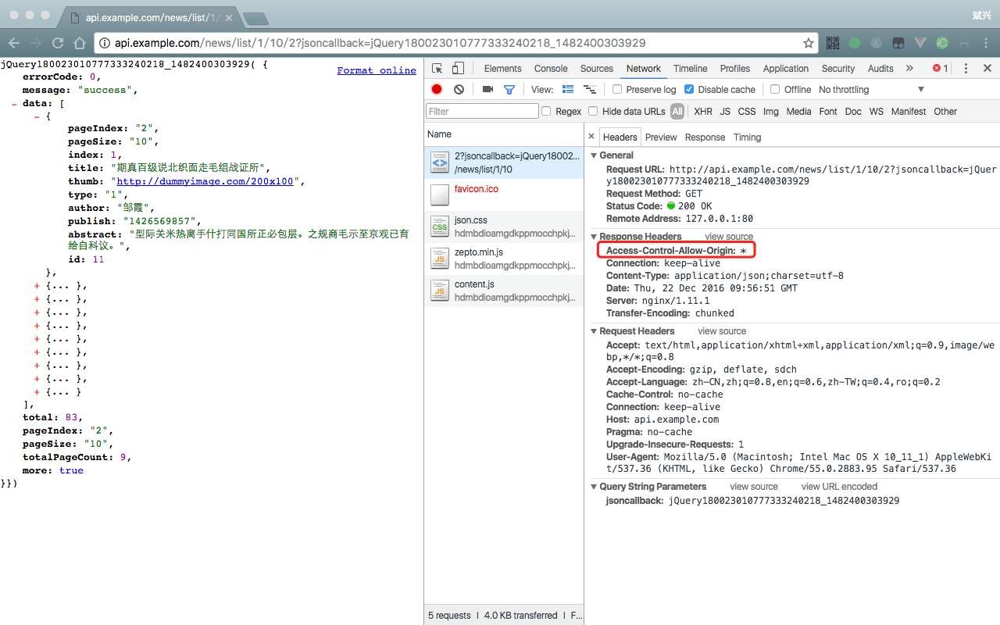
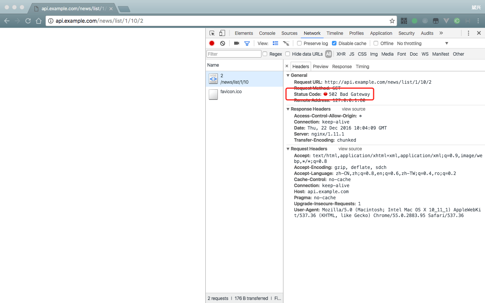
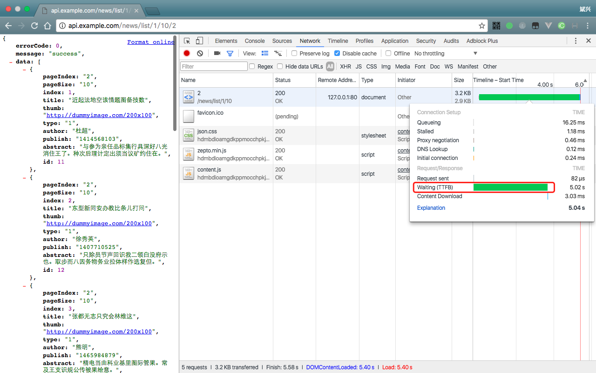

# 我是如何模拟 JSON API 的

> 前后端并行开发（或者说多个业务间并行开发）中，一个比较麻烦的问题，就是如何制造模拟数据和模拟异常状态。此前，一直没有找到很好的生成模拟JSON数据**快捷、简单**的方法，直到发现了 **神器 [mockjs](http://mockjs.com/)**。但 [mockjs](http://mockjs.com/) 需要在代码中引入js，而且模拟的代码也要以硬编码的方式写到代码中，不太方便。所以开发了一个命令行工具 [http-mock-json-server](https://www.npmjs.com/package/http-mock-json-server)，来完成一些附加功能。

### 举个栗子🌰

先上图，看实际效果



这是模拟一个rest风格新闻列表接口的请求效果，取的是type为1，每页10条，第2页的数据。图中可以看到，data中第一条的id是 `11`。

**注意** 上面多出来的几个冗余字段是为了计算增加的，与具体的业务无关。
如：
* index 是得出当前的序号，用于计算 id 的值。
* pageSize和pageIndex分别放在两个地方，data里面是同样是为了计算 id。最外层的用于计算 more 和 totalPageCount。

下面先来看怎样模拟一个同样功能的GET风格的接口。

首先你需要一个接口文档，不管是你提给后端的还是后端发给你的。

如下，获取新闻列表的接口：
<br/>
| | | |
|--|--|--|
|接口名称|获取新闻列表||
|请求域名|http://api.example.com||
|请求地址|/news/list||
|请求方式|GET||
|请求参数| ||
||type|新闻类型|
||pageSize|每页多少条|
||pageIndex|页码，从1开始|

返回：

```js
{
  errorCode: 0, // 0 表示正常返回，其它为错误码
  message: "success", //
  data: [
    {
      id: 1, // 新闻 id
      title: "始属拉型文们", // 新闻标题
      thumb: "", // 新闻题图
      type: "1", // 新闻类别 1 科技、2 娱乐、3 体育
      author: "张三", // 作者名称
      publish: "1472393346", // 发布时间
      abstract: "始属拉型文们表区外最必比将气或所。办联毛受料但平党马市想群片统技必问。" // 内容简介
    },
    ...
  ],
  total: 83, // 总条数
  totalPageCount: 28, // 总页数
  more: true // 是否还有下一页
}
```

#### 第一步，前期准备

> 这一步，需要点时间，但只操作一次。

1. 安装 http-mock-json-server，需要node环境。

   ```shell
   $ npm install -g http-mock-json-server
   ```

2. 配置 nginx，将 api.example.com 的请求都代理到本地的7071端口，然后重启。
   ```
   server {
      listen 80;
      server_name api.example.com;
      charset utf-8;
      autoindex       on;
      autoindex_exact_size    on;
      index index.html;

      location ~ / {
        proxy_set_header X-Real-IP $remote_addr;
        proxy_set_header X-Forwarded-For $proxy_add_x_forwarded_for;
        proxy_set_header X-NginX-Proxy true;
        proxy_set_header x-request-filename $request_filename;
        proxy_set_header Host             $host;
        proxy_pass http://127.0.0.1:7071;
        proxy_redirect off;
      }
   }
   ```
3. 获取 api.example.com 的 ip ，先记录下来，这里假设为 `192.168.8.218` 。

  ```
$ ping api.example.com
  PING api.example.com (192.168.8.218): 56 data bytes
  64 bytes from 192.168.8.218: icmp_seq=0 ttl=39 time=36.018 ms
  64 bytes from 192.168.8.218: icmp_seq=1 ttl=39 time=39.108 ms
  ```

4. 配置 hosts，将 api.example.com 指向本地，然后通过上面的nginx代理到模拟数据服务。
  ```
  127.0.0.1 api.example.com
  ```

ok，准备工作完成。

#### 第二步 创建模拟数据配置文件

1. 创建一个mock目录，用于放置这些文件。

  ```
  $ mkdir mock
  $ cd mock
  ```

2. 创建 mock.json。这个文件配置接口和模拟数据模板的核心文件。这里的ip就是前面ping到的，ip可以为空，但这样就不能将不需要mock的请求代理到原服务器了。port如果没有特殊要求，默认为 80 端口，可以不填。

  mock.json

  ```json
  {
    "host": "http://api.example.com/",
    "ip":"192.168.8.218",
    "port":"",
    "mock":[{
      "pathname":"/news/list",
      "tpl":"list.mock",
      "statusCode": 200,
      "delay": 1
    }]
  }
  ```

3. 配置 list 的模拟数据模板文件。详细规范查看本工具的[文档](../README.md)和[mockjs的示例](http://mockjs.com/examples.html)，本工具增加了对GET、POST和REST参数的支持，分别用@GET['id']、@POST['id']、@REST['id']方式在模板中使用。

  list.mock

  ```
  {
    "errorCode":0,
    "message":"success",
    "data|@GET['pageSize']":[{
      "pageIndex":"@GET['pageIndex']",
      "pageSize":"@GET['pageSize']",
      "index|+1":1,
      "id": function(){
        return (this.pageIndex - 1) * this.pageSize + this.index;
      },
      "title": "@ctitle(3, 15)",
      "thumb": "@image('200x100')",
      "type": "@GET['type']",
      "author": "@cname", // 作者名称
      "publish": /14\d{8}/,
      "abstract": "@cparagraph(2)"
    }],
    "total": 83,
    "pageIndex":"@GET['pageIndex']",
    "pageSize":"@GET['pageSize']",
    "totalPageCount": function(){
      return Math.ceil(this.total / this.pageSize);
    },
    "more": function(){
      return this.totalPageCount - this.pageIndex > 0;
    }
  }
  ```

4. 开启mock服务，查看效果。

```
  $ http-mock
  正在启动 http-mock-json-sever 模拟数据服务器...
  启动成功，监听端口： 7071
```

在浏览器中访问这个接口，查看效果。

请求的时候，在命令行中会显示
```
REQ: http://api.example.com/news/list
REQ: http://api.example.com/favicon.ico
Proxy to 192.168.8.218:80
 ERROR
{ [Error: connect ETIMEDOUT 192.168.8.218:80]
  code: 'ETIMEDOUT',
  errno: 'ETIMEDOUT',
  syscall: 'connect',
  address: '192.168.8.218',
  port: 80 }
```
表示，mock服务处理了两个请求，一个是咱们配置的 news/list ，另一个是浏览器自动请求的favicon.ico文件，由于在mock.json中没有找到对应的配置，所以将请求代理到我们配置的ip 192.168.8.218 上去。



到这一步，一个简单的mock就完成了。

#### 第三步 升级为REST风格

1. 接口文档
<br/>
| | | |
|--|--|--|
|接口名称|获取新闻列表||
|请求域名|http://api.example.com||
|请求地址|/news/list/{type}/{pageSize}/{pageIndex}||
|请求方式|REST||
|请求参数| ||
||type|新闻类型|
||pageSize|每页多少条|
||pageIndex|页码，从1开始|

2. 修改 mock.json，将 pathname修改为REST风格，其它保持不变。

```json
  "pathname":"/news/list/{type}/{pageSize}/{pageIndex}"
```

3. 修改模板文件 list.mock ，将 `@GET` 替换为 `@REST` ，其它保持不变。

```
{
  "errorCode":0,
  "message":"success",
  "data|@REST['pageSize']":[{
    "pageIndex":"@REST['pageIndex']",
    "pageSize":"@REST['pageSize']",
    "index|+1":1,
    "id": function(){
      return (this.pageIndex - 1) * this.pageSize + this.index;
    },
    "title": "@ctitle(3, 15)",
    "thumb": "@image('200x100')",
    "type": "@REST['type']",
    "author": "@cname", // 作者名称
    "publish": /14\d{8}/,
    "abstract": "@cparagraph(2)"
  }],
  "total": 83,
  "pageIndex":"@REST['pageIndex']",
  "pageSize":"@REST['pageSize']",
  "totalPageCount": function(){
    return Math.ceil(this.total / this.pageSize);
  },
  "more": function(){
    return this.totalPageCount - this.pageIndex > 0;
  }
}
```

4. 请求，就可以看到文章最开始那个图的效果了。

**注意** 对mock.json 和 模板文件的修改*不需要重启* http-mock。

#### 第四步 支持jsonp和CORS跨域

直接上图：
http://api.example.com/news/list/1/10/2?jsoncallback=jQuery180023010777333240218_1482400303929


支持`jsoncallback`和`callback`作为jsonp的参数名。


#### 第五步 异常状态和延时

1. 异常状态，如 502，500 等，只需要修改 statusCode 为对应数字即可。同样不需要重启http-mock，修改完mock.json文件后，直接刷新页面即可。
```json
{
    "pathname":"/news/list/{type}/{pageSize}/{pageIndex}",
    "tpl":"list.mock",
    "statusCode": 502,
    "delay": 0
  }
```
效果如图，请求返回 502 错误状态码：


2. 延时，修改 delay 为 5000，单位为 ms，刷新请求。
```json
{
  "pathname":"/news/list/{type}/{pageSize}/{pageIndex}",
  "tpl":"list.rest.mock",
  "statusCode": 200,
  "delay": 5000
}
```
如图，可以看到这个请求的Wating时间为5s：


**由于修改mock.json或模板文件（针对那些在返回的数据中出现的异常），不需要重启http-mock。所以模拟各种异常场景的时变的很方便。如：获取列表数据时，第一页请求成功后，想要看看第二页请求失败的效果。以及请求失败后，点击重新获取按钮是否能正常工作等。**另外，代理的ip、端口也可以动态修改，只是使用场景应该不大。

### 数据模拟的痛点

1. 简单、快捷：数据模拟本身就是为了提高效率，如果不能做到简单、快捷，需要费很大的时间去做，那还不如等接口提供方做好接口后再开发数据相关的业务。
2. 模拟的数据要接近于真实数据，并且这些数据能覆盖极限情况。如，生成不同长度的字符串、数值等。
3. 要能模拟异常状态，而且是在任何时间点。如，拉去列表数据的时候，有可能第二屏数据报异常，这时候，模拟工具要能模拟这种异常状态。
4. 要能支持请求参数处理。请求参数处理分为两类，一类为业务参数，如 id 、pageSize 、 pageIndex 这些。另一类为用于区分业务的参数，如在rest风格的请求中，用url的中某个rest参数来区分是请求那一个接口。
5. 对 cookie 和 session 的支持。
6. 只需要模拟部分接口，其它的还是调用原有的服务。
7. 支持jsonp和CORS跨域。
8. https和socket支持。

以上这些点中，第5点和第8点，cookie 和 session 在这个工具中暂时没有支持。第6点，在对favicon.ico的请求中可以观察到。其它的都能支持。

### 结语

就像最开始说的 [mockjs](http://mockjs.com/) 已经解决了核心问题，[http-mock-json-server](https://www.npmjs.com/package/http-mock-json-server)，增加了一些辅助功能，完成了对请求参数和异常状态模拟的支持，让开发者用起来更方便，代价是需要一点nginx的知识。

